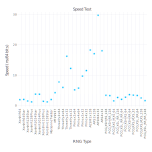

# Benchmark

```@meta
CurrentModule = RNG
```

This page includes the results of speed tests and big crush tests of several kinds of RNGs in this package.
The data is produced on such a computer:
```julia
julia> versioninfo()
Julia Version 0.5.0-rc0+0
Commit 633443c (2016-08-02 00:53 UTC)
Platform Info:
  System: Linux (x86_64-redhat-linux)
  CPU: Intel(R) Core(TM) i5-3470 CPU @ 3.20GHz
  WORD_SIZE: 64
  BLAS: libopenblas (USE64BITINT DYNAMIC_ARCH NO_AFFINITY Sandybridge)
  LAPACK: libopenblas64_
  LIBM: libopenlibm
  LLVM: libLLVM-3.7.1 (ORCJIT, ivybridge)
```
All the benchmark scripts are in the [benchmark](https://github.com/sunoru/RNG.jl/tree/master/benchmark)
directory, you can do the tests by yourself.

!!!note
    All the data here is only for reference, and will be updated as this package is updated.

## Speed Test

The speed test results are as following (the smaller is the better):



and detailed in the table (sorted by speed):

|RNG Type|Speed (ns/64 bits)|RNG Type|Speed (ns/64 bits)|RNG Type|Speed (ns/64 bits)|
|---|:-:|---|:-:|---|:-:|
|Xoroshiro128Star|1.184|PCG\_XSL\_RR\_128|2.646|Philox4x64|5.737|
|Xorshift128Plus|1.189|PCG\_XSH\_RS\_64|2.738|Threefry4x64|5.965|
|Xoroshiro128Plus|1.393|PCG\_XSH\_RR\_128|3.260|Threefry2x64|7.760|
|Xorshift128Star|1.486|PCG\_XSL\_RR\_64|3.308|Philox2x32|9.698|
|PCG\_RXS\_M\_XS\_64|1.522|PCG\_XSH\_RS\_128|3.373|Philox4x32|11.517|
|PCG\_XSL\_RR\_RR\_128|1.602|PCG\_RXS\_M\_XS\_32|3.420|Threefry4x32|12.241|
|Xorshift64|1.918|PCG\_XSH\_RR\_64|3.580|Threefry2x32|16.253|
|BaseMT19937\*|1.971|Xorshift1024Plus|3.725|ARS1x128|17.081|
|Xorshift64Star|2.000|Xorshift1024Star|3.748|ARS4x32|18.059|
|PCG\_XSL\_RR\_RR\_64|2.044|MT19937|4.229|AESNI1x128|18.304|
|PCG\_RXS\_M\_XS\_128|2.482|Philox2x64|5.161|AESNI4x32|29.770|

\*`BaseMT19937` denotes to `Base.Random.MersenneTwister`.

## Big Crush Test

10 kinds of RNGs (which are worth considering) have been tested with Big Crush test batteries:

|RNG Type|Speed (ns/64 bits)|Total CPU time|Failed Test(s)\*|
|---|:-:|:-:|---|
|AESNI1x128|18.304|04:14:22.19| |
|ARS1x128|17.081|04:13:27.54|55 SampleCorr, k = 1 p-value = 7.0e-4|
|BaseMT19937|1.971|03:18:23.47| |
|MT19937|4.229|03:32:59.06|36 Gap, r = 0 p-value = eps<br>80LinearComp, r = 0 p-value = 1-eps1<br>81  LinearComp, r = 29 p-value = 1-eps1|
|PCG\_RXS\_M\_XS\_64\_64|1.522|03:20:07.97| |
|PCG\_XSH\_RS\_128\_64`|3.373|03:24:57.54|54  SampleMean, r = 10              0.9991|
|Philox2x64|5.737|03:28:52.27|35  Gap, r = 25  3.4e-4|
|Threefry2x64|5.965|03:37:53.53| |
|Xoroshiro128Plus|1.393|03:33:16.51| |
|Xorshift1024Star|3.748|03:39:15.19| |
\*eps means a value < 1.0e-300, and eps1 means a value < 1.0e-15.

It is interesting that BaseMT19937 passes all the tests when generating `UInt64` (by generating two `UInt32`
with dSFMT). The PCG ones do not pass all the tests as the paper says, but the failures are just near the
threshold. The RNG with best performance here is `Xoroshiro128Plus`, which passes all the tests and has an
excellent speed.
